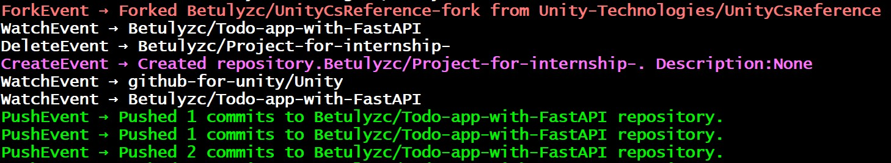
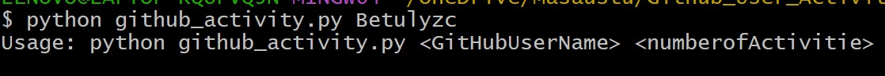
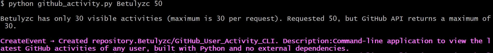

# GitHub User Activity CLI
This command-line interface (CLI) application fetches and displays the recent public activity of a given GitHub user using the GitHub API. It is a simple and lightweight tool written in Python, with no external dependencies.

---

##  Features
- Fetches the most recent public activity of any GitHub user.
- No third-party libraries required — uses Python’s built-in `urllib` and `json` modules.
- Allows customization of how many recent events to display.
- Provides detailed output for key activity types such as `Push`, `Pull Request`, `Issue Comment`,`Fork` and `Create`. Other events are shown with their type and associated repository.
- Handles errors gracefully, including invalid usernames, API rate limits, connection problems, and users with no recent activity.

---

## Usage

###  Command

python github_activity.py  *GitHubUsername* *NumberOfActivities*

Example: **python github_activity.py Betulyzc 5**

Arguments:

Argument	            Description
*GitHubUsername* = The GitHub username to query

*NumberOfActivities* = The number of recent activities to display

## Supported GitHub Event Types

- PushEvent: Shows number of commits pushed
- PullRequestEvent: Indicates when a pull request is opened
- CreateEvent: Describes newly created repositories or branches
- IssueCommentEvent: Displays issue comment details
- Others: Displayed in a general format

## 📸 Example Output

### GitHub Activity CLI Output

### Missing Parameter Output

### Limited Data Output

## License

This project is intended for educational and personal use. Feel free to modify and share under an open-source spirit.

This CLI was inspired by the project section of the **Backend Developer Roadmap** available at [roadmap.sh](https://roadmap.sh/backend). The idea was adapted and implemented to reinforce learning through hands-on API usage and CLI development.

